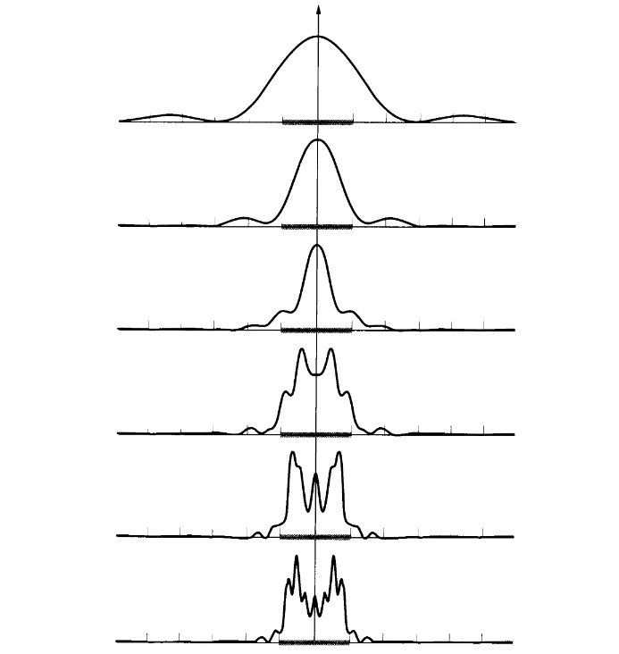

!!! quote "Interference or Diffraction?"
    There is no significant physical distinction between interference and diffraction. It is somewhat customary to speak of interference when considering the superposition of only a few waves and diffraction when treating a large number of waves. Even so, one refers to multiple-beam interference in one context and diffraction from a grating in another.

## Huygens-Fresnel Principle

### Hygens Principle

**Hygens stated**, Each point on a wavefront can be envisaged as a source of secondary spherical wavelets. At any particular time, the shape of the wavefront is supposed to be the envelope of the secondary wavelets.

However, this principle ignores most of each secondary wavelet, retaining only the envelope part. That is to say we don't konw how these different secondary wavelets interact with each other.

### Fresnel's Addition

**Hygens-Fresnel Principle** states that every unobstructed point of a wavefront, at a given instant, serves as a source of spherical secondary wavelets (with the same frequency as that of the primary wave). The amplitude of the optical field at any point beyond is the superposition of all these wavelets (*They interfer with each other*).

!!! note "compare wavelength and aperture"
    By triangle inqueality:

    $$\begin{aligned}
        \lambda&\geq a\Rightarrow \text{all interfere constructively}\\
        \lambda&\leq a\Rightarrow \text{interfere constructively and destructively}
    \end{aligned}$$

### Kirchhoff Modification

Rigorous equation is:

$$ U(P)= K\iint_\Sigma\frac{U(x,y)e^{ikr}}{r}F(\theta_0,\theta)d\Sigma$$

where

$$\begin{aligned}
    K&=\frac{-i}{\lambda}\\
    F(\theta_0,\theta)&=\frac{\cos\theta_0+\cos\theta}{2}
\end{aligned}$$

## Diffraction Types

From top to bottom: Fraunhoffer Diffraction to Fresnell Diffraction.

Roughly speaking, There are two types of diffraction.

- **Fresnell Diffraction**

    Distances between source, diffraction screen or observation screen is finite, or at least one of them is finite.

    aka. Near-Field Diffraction.

- **Fraunhoffer Diffraction**

    Distances are infinite. aka. Far-Field Diffraction.

## Fraunhoffer Diffraction

### Approximation

$$r=r_0-\frac{xx^\prime+yy^\prime}{z}$$

where $r_0$ is distance between center of slit and field point P.

Normal incident: $\theta=0$ and $\theta^\prime=0$, thus $F(\theta_0,\theta)=1$.

### Single Slit

$$U(\theta^\prime)=KU_0\frac{e^{ikr_0}}{r_0}\int_{-\frac{a}{2}}^\frac{a}{2}e^{-ik\frac{xx^\prime}{z}}\mathrm{d}x=KU_0a\frac{e^{ikr_0}}{r_0}\frac{\sin\alpha}{\alpha}$$

$\alpha=\frac{\pi a\sin\theta}{\lambda}$.

### Rectangular Aperture

Suppose window is a square, then

$$U(x^\prime,y^\prime)=KU_0a_1a_2\frac{e^{ikr_0}}{r_0}\frac{\sin\alpha_1}{\alpha_1}\frac{\sin\alpha_2}{\alpha_2}$$

where $\alpha_1=\frac{\pi a_1\sin\theta}{\lambda}$ and $\alpha_2=\frac{\pi a_2\sin\theta}{\lambda}$.

### Circular Aperture and Resolving Power

### N-Slits

